# DILLM-Light-Small CrossAttn

本仓库是毕业设计《多模态视觉语言导航模型的轻量化方法研究》的代码与实验材料整理版本。项目基于 [DILLM](https://github.com/wangjw55/DILLM) 进行轻量化改进，面向视觉语言导航（Vision-and-Language Navigation, VLN）任务，在保留 DILLM 指令分解、层级强化学习和多模态融合判别器思想的基础上，进一步压缩模型参数、降低推理开销，并验证其在 ROS 机器人系统中的部署可行性。


## 项目概览

视觉语言导航任务要求智能体根据自然语言指令在复杂室内环境中完成自主导航。原始 DILLM 使用开源大语言模型将长导航指令分解为子指令，再通过强化学习智能体顺序完成子目标。本项目在该框架上重点做轻量化设计：

- 使用 CLIP-RN50x4 特征和子指令分解结果作为视觉语言对齐基础。
- 引入门控式视觉-物体语义融合投影，将视觉特征和物体语义特征压缩后送入 decoder。
- 增加语言条件视觉注意力，使视觉注意力查询能够结合当前子指令语义。
- 冻结 CLIP 计算图、缓存 CLIP 文本特征，并在推理阶段使用 `torch.no_grad()` 降低重复计算。
- 增加参数量、推理速度、日志持久化等实验可观测性输出。
- 设计 VC-ROSVLN 分层部署方案，将轻量化 VLN 策略接入 ROSMASTER X3 机器人平台。

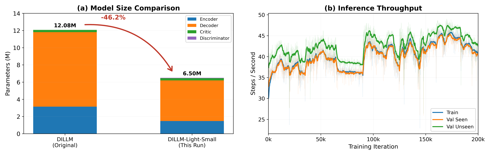

## 论文结果摘要

| 模型 | 参数量 | val seen SR | val seen SPL | val unseen SR | val unseen SPL | 推理吞吐 |
| --- | ---: | ---: | ---: | ---: | ---: | ---: |
| DILLM 复现基准 | 12.10M | 57.2% | 0.51 | 49.4% | 0.44 | 9 step/s |
| DILLM-Light-Small（本文） | 6.50M | 56.4% | 0.51 | 51.0% | 0.42 | 39 step/s |

主要结论：

- 参数量从 12.10M 降至 6.50M，减少约 46%。
- 决策吞吐从约 9 step/s 提升到约 39 step/s。
- 在 R2R val unseen 上 SR 达到 51.0%，相较复现基准没有出现明显性能退化。
- 轻量化模型可以作为 ROS 机器人系统中的策略服务模块，通过远程推理接口与车端执行层解耦。

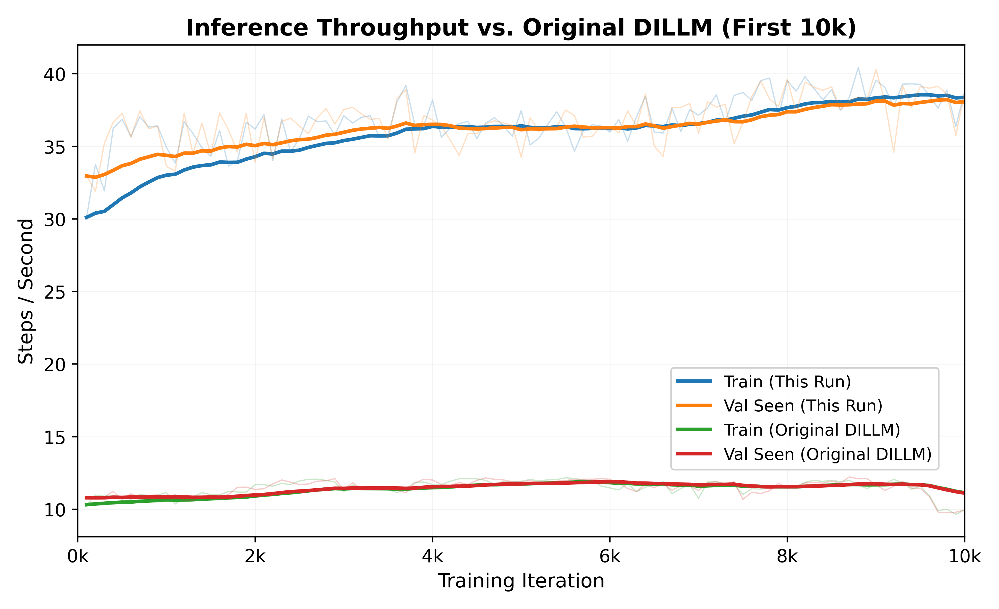

## 方法设计

项目整体仍沿用 DILLM 的“指令分解 - 子目标执行 - 完成判别”流程。长指令先被 ChatGLM 分解为多个子指令，智能体在每个阶段根据当前子指令、视觉观测和候选动作进行决策；多模态融合判别器用于判断当前子目标是否完成，并决定是否切换到下一阶段。

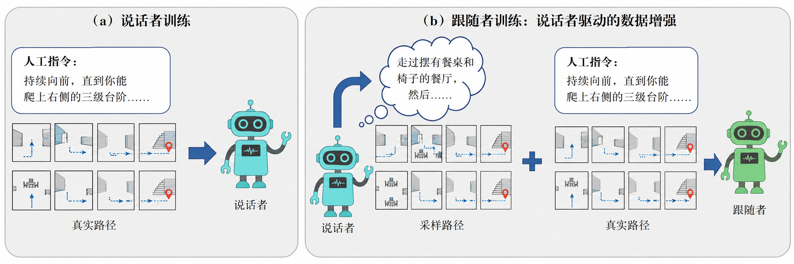

本项目的轻量化重点集中在 decoder 输入侧。原始结构中，图像特征进入 decoder，而物体语义特征主要服务于 discriminator，二者存在信息割裂。本项目新增 `FusionProjection`，将视觉特征与物体语义特征映射到较低维空间，并通过门控机制自适应融合，再与角度特征拼接后输入 decoder。

核心代码位于 [r2r_src/model.py](r2r_src/model.py)：

```python
class FusionProjection(nn.Module):
    def __init__(self, vis_dim=640, obj_dim=640, out_dim=384):
        super(FusionProjection, self).__init__()
        self.vis_proj = nn.Linear(vis_dim, out_dim, bias=False)
        self.obj_proj = nn.Linear(obj_dim, out_dim, bias=False)
        self.gate = nn.Linear(out_dim + out_dim, out_dim)

    def forward(self, vis, obj):
        v = self.vis_proj(vis)
        o = self.obj_proj(obj)
        g = torch.sigmoid(self.gate(torch.cat([v, o], dim=-1)))
        return g * v + (1 - g) * o
```

## 仿真实验可视化

训练过程中的导航成功率、累计奖励、Critic 损失、策略熵和动作数变化如下图所示。

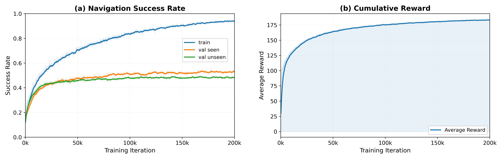

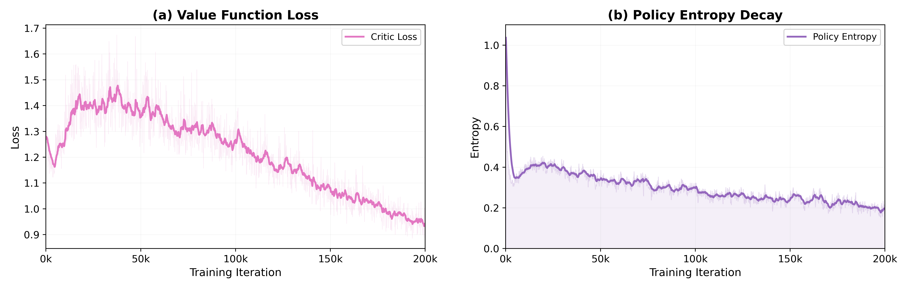

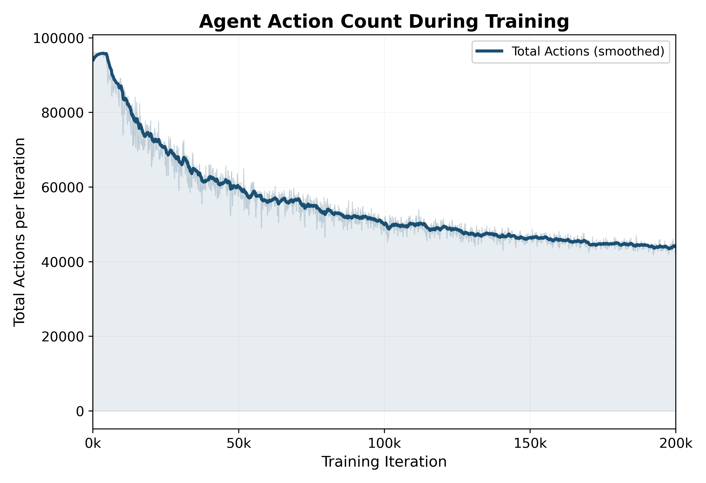

在 Matterport3D 仿真环境中，模型能够根据分解后的语言子目标完成连续导航，并在已见与未见环境中生成较稳定的轨迹。

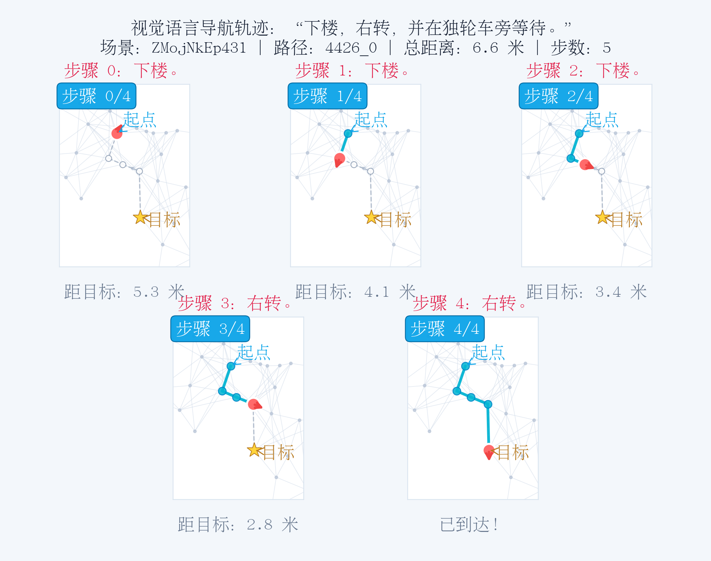

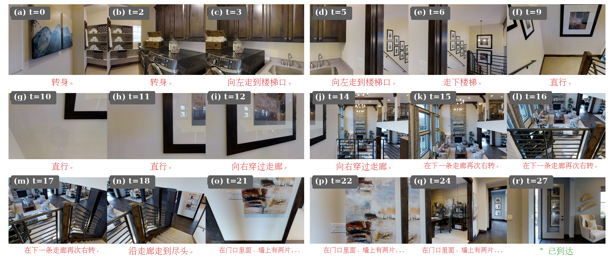

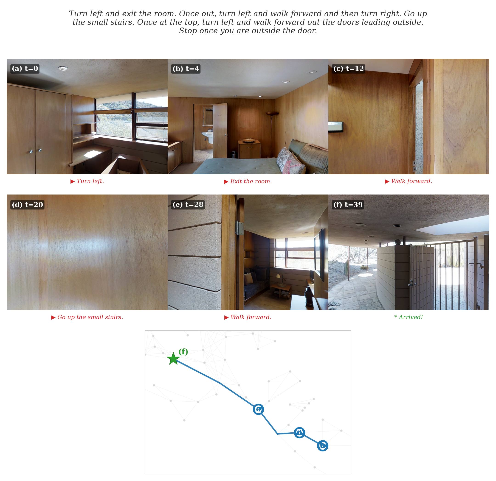

## ROS 部署验证

论文中进一步设计了 VC-ROSVLN 系统，用于验证轻量化 VLN 模型在 ROSMASTER X3 平台上的接入方式。系统采用“车端执行、服务端推理”的分层结构：车端 ROS 节点负责采集 RGB、深度、LaserScan 和里程计等状态，并执行 `cmd_vel` 控制；上位机或服务端负责语言理解、策略推理和动作原语返回。

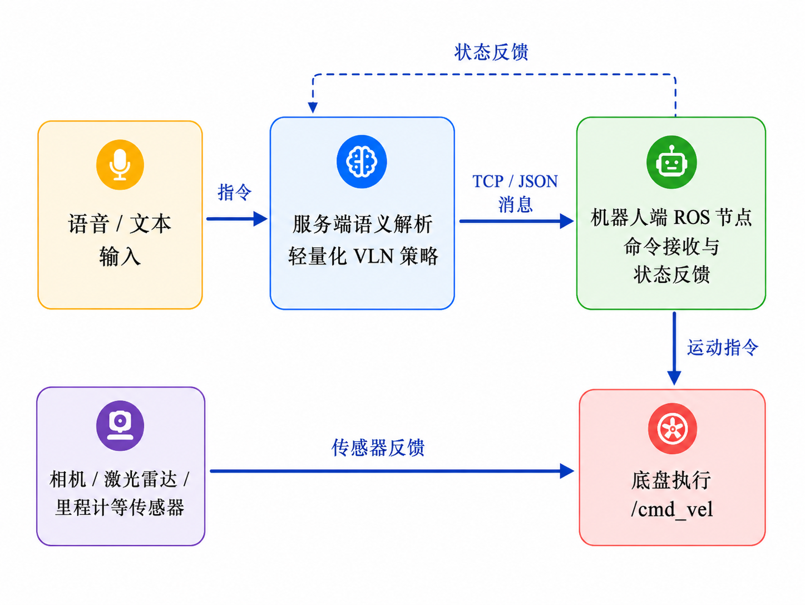

实车平台包括语音识别模块、Astra 相机、激光雷达、车载计算单元和 ROSMASTER X3 底盘。真实部署阶段主要关注仿真全景观测与真实前向观测之间的差异、连续底盘控制映射、障碍物安全约束和远程策略接口稳定性。

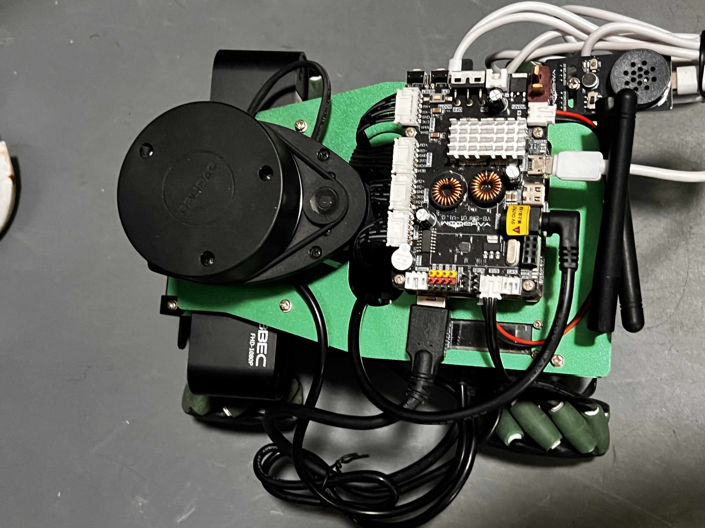

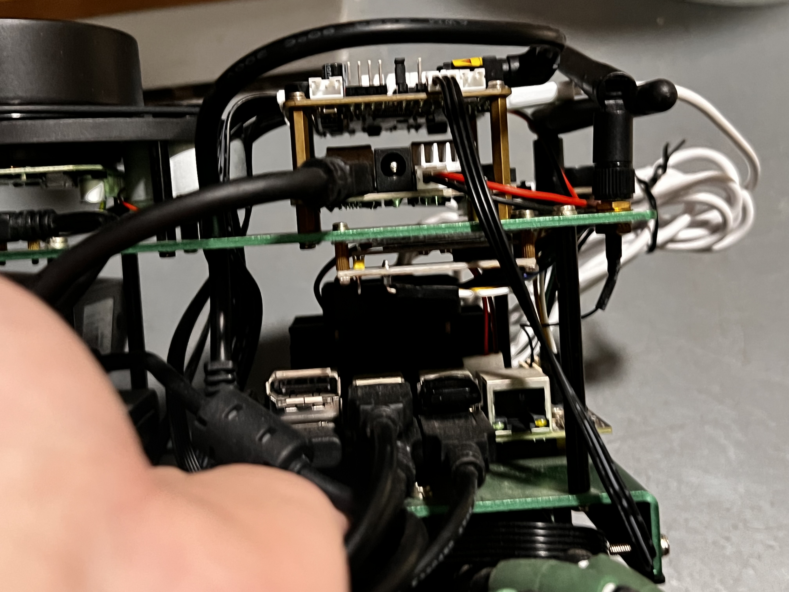

## 仓库结构

```text
.
+-- r2r_src/                  # R2R 训练、评估、环境、模型与智能体代码
|   +-- agent.py              # Seq2SeqAgent、rollout、推理缓存、指标记录
|   +-- model.py              # Encoder、Decoder、FusionProjection、FFNet
|   +-- train.py              # 训练/验证入口与日志持久化
|   +-- env.py                # R2RBatch 环境与特征读取
|   +-- param.py              # 命令行参数配置
+-- run/                      # 训练、测试和 seed search 脚本
+-- tasks/R2R/data/           # R2R 数据、词表、子指令分解结果
+-- connectivity/             # Matterport3D 连通图
+-- img_features/             # 图像/物体特征文件放置目录
+-- docs/readme_assets/       # 从论文中导出的 README 图片
+-- CHANGES.md                # 本项目相对 DILLM 的改进记录
+-- python_requirements.txt   # Python 依赖
+-- CMakeLists.txt            # Matterport3D Simulator 编译配置
```

## 环境配置

环境配置、Matterport3D Simulator 编译、数据集准备、图像特征下载与 ChatGLM/CLIP 相关配置请优先参考原始 DILLM 仓库：

```text
https://github.com/wangjw55/DILLM
```

本仓库保留了上游项目的基本依赖文件：

```bash
pip install -r python_requirements.txt
```

主要依赖包括：

- Python 3.8
- PyTorch / torchvision
- NumPy
- networkX
- tensorboardX
- tqdm
- transformers
- CLIP
- Matterport3D Simulator 及其 Python binding

注意事项：

- `img_features/` 下需要放置 CLIP-RN50x4 视图特征和物体特征文件。
- `connectivity/` 和 `tasks/R2R/data/` 需要与 R2R/Matterport3D 数据保持一致。
- [r2r_src/agent.py](r2r_src/agent.py) 中 `clip.load(..., download_root=...)` 的路径可能需要按本机环境修改。
- [run/test_agent.bash](run/test_agent.bash) 中 `--load` 默认是作者本机路径，复现实验前需要改为自己的 checkpoint 路径。

## 训练与测试

训练默认脚本：

```bash
bash run/agent.bash 0
```

该脚本使用的核心参数包括：

```text
--train listener
--features rn50x4
--feature_size 640
--batchSize 64
--angleFeatSize 128
--option_size 8
--option_step 3
--optim adam
--lr 1e-4
--iters 200000
--maxAction 15
```

测试脚本：

```bash
bash run/test_agent.bash 0
```

快速 seed search：

```bash
bash run/seed_search.bash 0
```

训练日志会自动写入 `log/`，模型快照和 TensorBoard 文件会写入 `snap/<name>/`。

## 与上游 DILLM 的主要差异

详细改动见 [CHANGES.md](CHANGES.md)。核心差异包括：

- `FusionProjection`：将视觉特征和物体语义特征门控融合，并压缩 decoder 输入维度。
- `--fusionProj`：可选启用门控融合投影。
- `--crossAttn`：可选启用语言条件视觉注意力。
- CLIP 冻结：`requires_grad_(False)` 与 `eval()` 固定 CLIP 行为。
- 子指令文本特征缓存：减少重复 `clip.tokenize` 和 `encode_text`。
- 推理阶段 `torch.no_grad()`：降低显存占用和计算图开销。
- discriminator 梯度裁剪补全：提升子目标完成判别训练稳定性。
- 日志持久化：每次运行自动生成 `log/<timestamp>_<name>.log`。
- 指标监控：输出参数量、平均 step time、steps/s、rollout time 等效率指标。

## 引用与致谢

本项目基于 DILLM 开源代码和论文工作完成：

- 原项目仓库：[https://github.com/wangjw55/DILLM](https://github.com/wangjw55/DILLM)
- 原论文：Boosting Efficient Reinforcement Learning for VLN with Open-Sourced LLM

如果使用本仓库，请同时遵守原 DILLM 项目、Matterport3D Simulator、R2R 数据集和相关依赖的许可证与数据使用协议。
